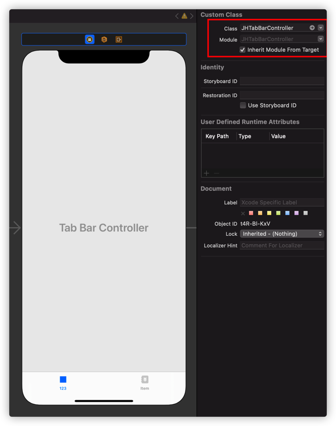
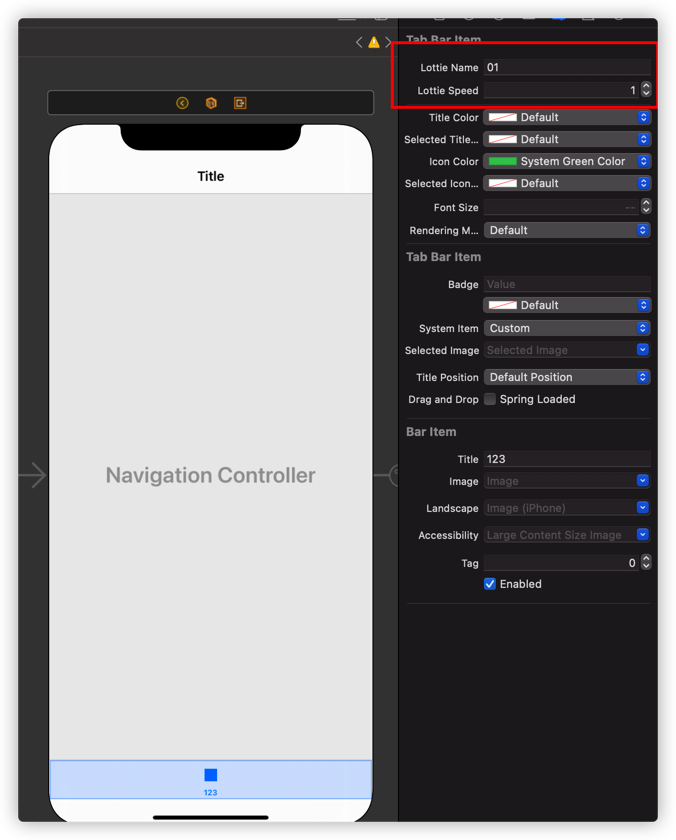
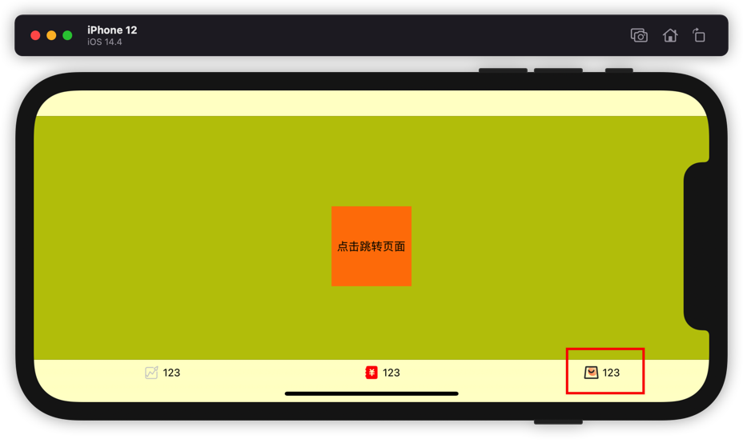

[](http://cocoapods.org/pods/JHTabBarController)
[](https://swift.org/package-manager/)


这是一个接近原生UITabBarController的TabBar控制器，支持Lottie动效，也可以在此基础上做一些滑块切换动画

### 特性

- [x] 支持Lottie动画。
- [x] 支持lottie 和 image混合的使用。
- [x] 支持横竖屏切换及排版动态变化。
- [x] 支持XIB创建
- [ ] 滑块切换动画

### 注意事项

1. lottie和image同时存在时，如果有 import Lottie仓库会用Lottie隐藏Image（lottie为第一响应序列）

2. 只有title时会居中展示（image为nil）

3. 只有image或者只有lottie都会居中展示（title为nil）

   

## 安装

### Cocoapods

1.在 Podfile 中添加 `pod ‘JHTabBarController’` 
使用Lottie效果请添加 `pod 'JHTabBarController/Lottie'`

2.执行 `pod install 或 pod update`

3.导入 `import JHTabBarController`

### Swift Package Manager

从 Xcode 11 开始，集成了 Swift Package Manager，使用起来非常方便。JHTabBarController 也支持通过 Swift Package Manager 集成。

在 Xcode 的菜单栏中选择 `File > Swift Packages > Add Pacakage Dependency`，然后在搜索栏输入

`https://github.com/jackiehu/JHTabBarController`，即可完成集成，默认依赖Lottie。

### 手动集成

JHTabBarController 也支持手动集成，只需把Sources文件夹中的JHTabBarController文件夹拖进需要集成的项目即可


## 参数

```swift
var image  					默认icon
var selectedImage  			选中状态icon
var title  					标题
var lottieName: 				Lottie文件名称
var textFontSize				标题字体大小
var textColor					标题未选中颜色
var selectedTextColor			标题选中颜色
var renderingMode: Bool 		icon是否使用图片自带颜色
var iconColor					icon使用自定义颜色  默认颜色
var selectedIconColor			icon使用自定义颜色  选中颜色

```

## 使用

### 纯代码创建：

```swift
        let v1 = ViewController()
        let item1 = UITabBarItem()
        item1.image = UIImage.init(named: "tab_chat_nor")
        item1.selectedImage = UIImage.init(named: "tab_chat_hi")
        item1.title = "123"
        v1.tabBarItem = item1
        
        let v2 = ViewController()
        let item2 = UITabBarItem()
        item2.image = UIImage.init(named: "tab_home_nor")
        item2.selectedImage = UIImage.init(named: "tab_home_hi")
        v2.tabBarItem = item2
        
        let v3 = ViewController()
        let item3 = UITabBarItem()
        item3.image = UIImage.init(named: "tab_mine_nor")
        item3.selectedImage = UIImage.init(named: "tab_mine_hi")
        item3.lottieName = "03"
        v3.tabBarItem = item3
        
        let nav1 = UINavigationController.init(rootViewController: v1)
        let nav2 = UINavigationController.init(rootViewController: v2)
        let nav3 = UINavigationController.init(rootViewController: v3)
        
        let tab = JHTabBarController()
        tab.viewControllers = [nav1,nav2,nav3]
        tab.selectedIndex = 0
        
        let windowScene = scene as! UIWindowScene
        window? = UIWindow.init(windowScene: windowScene)
        window?.frame = windowScene.coordinateSpace.bounds
        window?.makeKeyAndVisible()
        window?.rootViewController = tab
        window?.backgroundColor = .white
```

### Storyboard创建：

|  |  |
| ------------------- | ------------------- |
|  |  |


具体用法详见Demo

## 更多砖块工具加速APP开发

[](https://github.com/jackiehu/SwiftBrick)

[](https://github.com/jackiehu/SwiftMediator)

[](https://github.com/jackiehu/SwiftShow)

[](https://github.com/jackiehu/SwiftLog)

[](https://github.com/jackiehu/SwiftyForm)

[](https://github.com/jackiehu/SwiftEmptyData)

[](https://github.com/jackiehu/SwiftPageView)

[](https://github.com/jackiehu/SwiftMesh)

[](https://github.com/jackiehu/SwiftNotification)

[](https://github.com/jackiehu/SwiftNetSwitch)

[](https://github.com/jackiehu/SwiftButton)

[](https://github.com/jackiehu/SwiftDatePicker)