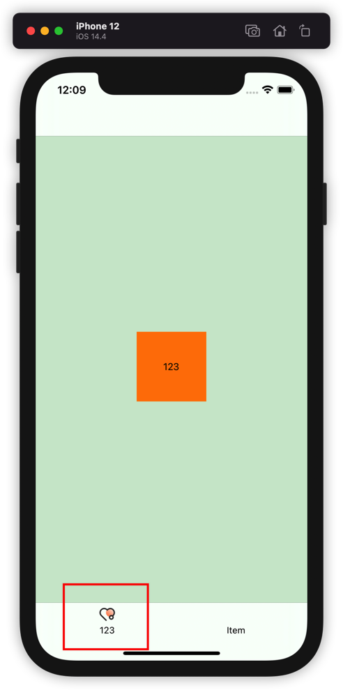

支持Lottie动画的UITabBarController。支持横竖屏排版动态变化，支持lottie 和 image混合的Tabbar。

### 注意事项

1. lottie和image同时存在时，如果有 import Lottie仓库会用Lottie隐藏Image（lottie为第一响应序列）
2. 只有title时会居中展示（image为nil）
3. 只有image或者只有lottie都会居中展示（title为nil）

### 参数

## 使用

```swift
var image  					默认icon
var selectedImage  			选中状态icon
var title  					标题
var lottieName: 				Lottie文件名称
var textFontSize				标题字体大小
var textColor					标题未选中颜色
var selectedTextColor			标题选中颜色
var renderingMode: Bool 		icon是否使用图片自带颜色
var iconColor					icon使用自定义颜色  默认颜色
var selectedIconColor			icon使用自定义颜色  选中颜色

```

### 使用

纯代码创建：

```swift
        let v1 = ViewController()
        let item1 = UITabBarItem()
        item1.image = UIImage.init(named: "tab_chat_nor")
        item1.selectedImage = UIImage.init(named: "tab_chat_hi")
        item1.title = "123"
        v1.tabBarItem = item1
        
        let v2 = ViewController()
        let item2 = UITabBarItem()
        item2.image = UIImage.init(named: "tab_home_nor")
        item2.selectedImage = UIImage.init(named: "tab_home_hi")
        v2.tabBarItem = item2
        
        let v3 = ViewController()
        let item3 = UITabBarItem()
        item3.image = UIImage.init(named: "tab_mine_nor")
        item3.selectedImage = UIImage.init(named: "tab_mine_hi")
        item3.lottieName = "03"
        v3.tabBarItem = item3
        
        let nav1 = UINavigationController.init(rootViewController: v1)
        let nav2 = UINavigationController.init(rootViewController: v2)
        let nav3 = UINavigationController.init(rootViewController: v3)
        
        let tab = JHTabBarController()
        tab.viewControllers = [nav1,nav2,nav3]
        tab.selectedIndex = 0
        
        let windowScene = scene as! UIWindowScene
        window? = UIWindow.init(windowScene: windowScene)
        window?.frame = windowScene.coordinateSpace.bounds
        window?.makeKeyAndVisible()
        window?.rootViewController = tab
        window?.backgroundColor = .white
```

Storyboard创建：

|  |  |
| ------------- | ------------- |
|  |  |


具体用法详见Demo

### 安装

#### cocoapods导入

```
支持ios11以上版本，swift5支持
默认
pod 'JHTabBarController'
使用Lottie
pod 'JHTabBarController/Lottie'
```

#### SPM导入

`https://github.com/jackiehu/JHTabBarController`

#### 手动导入

